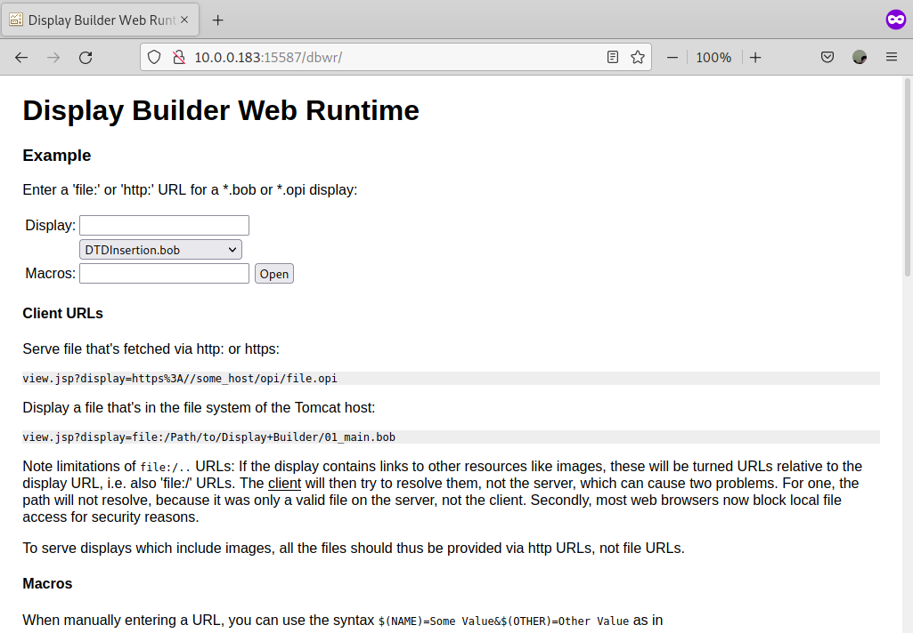

# EPICS Display Builder Web Runtime Configuration Environment

Configuration Environment for [EPICS Display Builder Web Runtime](https://github.com/ornl-epics/dbwr) for [the Advanced Light Source (ALS) and Upgrade (ALS-U) Project](https://als.lbl.gov/als-u/overview/) at [Lawrence Berkeley National Laboratory](https://lbl.gov).

## Please

One should understand that 
- This repository is a **simple tool** to help users to setup, maintain, and upgrade EPICS Display Builder Web Runtime easily.

## Pre-requirement packages

### Debian 11

```bash
git make sudo which curl wget
```


### JAVA and MAVEN

Default JAVA and MAVEN configuration are for Debian 11. Please set JAVA and MAVEN according to your system.

Please check several rules in `configure/RULES_REQ` for preparation of your own JAVA and MAVEN environment.
Note that `JAVA_HOME`,`JAVA_PATH`, `MAVEN_HOME`, and `MAVEN_PATH` must be defined without any variables.

### Tomcat9

We don't need the Tomcat service running, but does the package itself. The default Tomcat9 is for the Debian 11.
Please check several Makefile rules for Tomcat9 such as `make tomcat.......`

```bash
$ make vars FILTER=TOMCAT_

------------------------------------------------------------
>>>>          Current Environment Variables             <<<<
------------------------------------------------------------

TOMCAT_DEFAULT_PORT = 8083
TOMCAT_DEFAULT_SERVER_XML = server.xml
TOMCAT_HOME = /usr/share/tomcat9
TOMCAT_INSTALL_LOCATION = /opt/tomcat9
TOMCAT_MAJOR_VER = 9
TOMCAT_MINOR_VER = 0.58
TOMCAT_SRC = apache-tomcat-9.0.58.tar.gz
TOMCAT_URL = "https://archive.apache.org/dist/tomcat/tomcat-9/v9.0.58/bin/apache-tomcat-9.0.58.tar.gz"
TOMCAT_VER = 9.0.58
```

## Build, install, and Service


```
make init
make conf
make conf.show
```
Note that `dbwr_settings.conf` file is generated in `TOP`. Please update `WHITELIST` variables accordingly. Makefile cannot handle Regular expression. One shoud add them manually into a generated configuration file `dbwr_settings.conf`. The list of `WHITELIST` will be generated according to the list of `DBWR` in `CONFIG_APPNAME`.

```
make build
make install
make exist
make exist LEVEL=3
```

## SystemD

```
$ make sd_enable
$ make sd_start
$ make sd_status
$ systemctl status dbwr
● dbwr.service - EPICS Display Builder Web Runtime for ALS
     Loaded: loaded (/opt/displaybuilderweb/dbwr.bash; enabled; vendor preset: enabled)
     Active: active (running) since Sat 2022-05-14 21:20:01 PDT; 5min ago
       Docs: https://github.com/ornl-epics/dbwr
    Process: 8916 ExecStart=/bin/bash -c /opt/displaybuilderweb/dbwr.bash startup (code=exited, status=0/SUCCESS)
   Main PID: 8928 (java)
      Tasks: 39 (limit: 9341)
     Memory: 257.0M
        CPU: 12.905s
     CGroup: /system.slice/dbwr.service

```

##
* http://localhost:15587/dbwr

## Scripts

Note that `USER` should be in `USERID` or `GROUPID`. Typically, in Linux, `USER` should be in the tomcat group. One can use `sudo` permission to run the following script. However, please keep in mind that systemd is executed by tomcat account. If one starts it with `sudo` permission at first, systemd cannot do. In this case, `chown -R tomcat:tomcat /opt/displaybuilderweb` is required to recover this issue.

```
/opt/displaybuilderweb/dbwr.bash startup
/opt/displaybuilderweb/dbwr.bash shutdown
/opt/displaybuilderweb/dbwr.bash status
```

It is convenient to add `USER` to tomcat group by `sudo usermod -aG tomcat $USER`.

## Screenshot


||
| :---: |
|**Figure 1** Firefox Display Builder Web Runtime Home Page Screenshot.|
